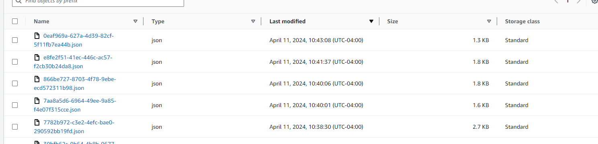
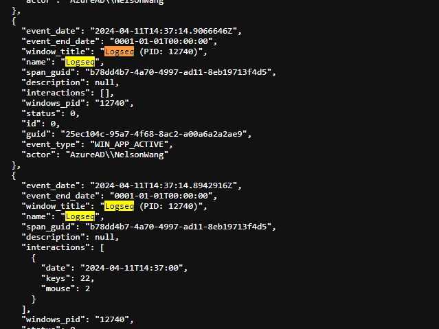
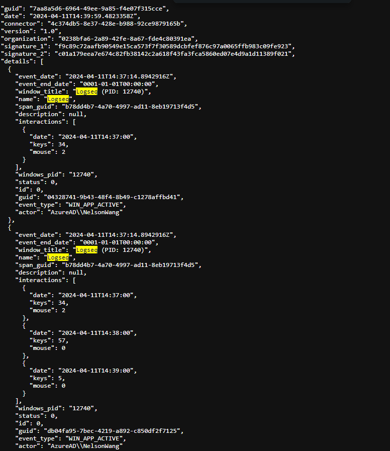
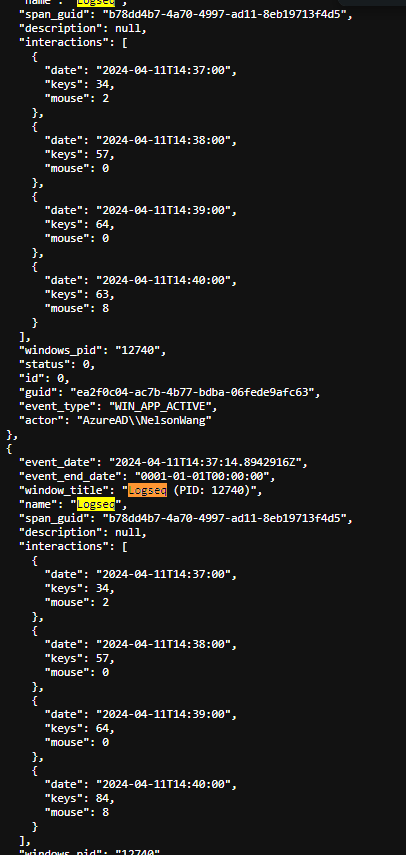
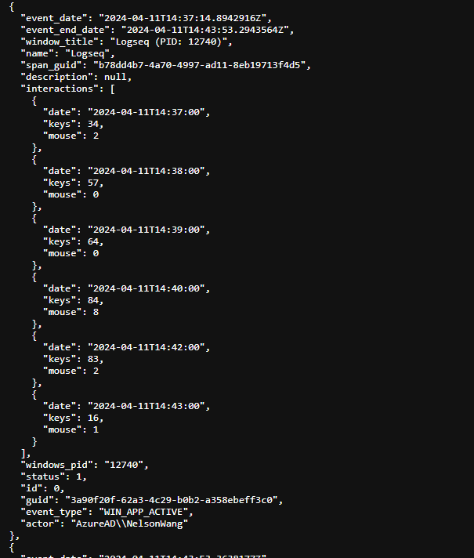
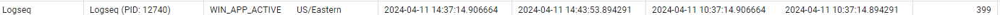
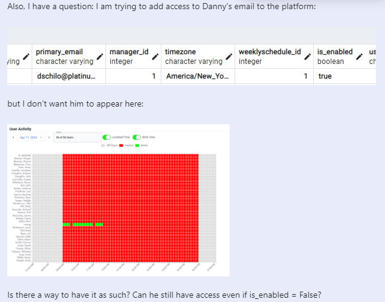

- DONE Revise the Windows Solution
  :LOGBOOK:
  CLOCK: [2024-04-11 Thu 09:18:50]
  :END:
- TODO Revise the Advanced React TS: https://ppubs.uspto.gov/pubwebapp/static/pages/ppubsbasic.html
- TODO Revise with Basta and started a Night shift on Wednesdays.
	- Does it make sense strategically speaking?
	- Revise on the course content and materials.
- TODO Think about what can you do with Patents: https://ppubs.uspto.gov/pubwebapp/static/pages/ppubsbasic.html
- DONE Draw some more charts on Balsamiq
- TODO Consider
- TODO Write about the Pairing case
- TODO Add each Data Science Notes into git lab book.
- TODO Write the emails for Compete
- TODO Prepare Compete Guidelines
- TODO Work on the backend of the site at least (SLC)
-
-
-
-
- ## Testing DDWin
- ### DDWin Testcase 1:
	- lets start writing on DDWin from 10:38 to 10:43
	- I should expect 1 long event of around 3 minutes
	- With multiple clicks and keyboard to have. an single event.
	- Result:
	- 
	- I should expect 1 event around every 1 minute starting from 38. Lets review what is being sent at each point.
		- Lets see: 778:
		  collapsed:: true
			- 
			- We see two logseqs
		- 7aa8a5d6 - 10:38:30
		  collapsed:: true
			- 
		- 866be727 - 10:40:01
		  collapsed:: true
			- Here no logseq events were added.
		- 0238bfa6 -
		  collapsed:: true
			- 
			- The end date should be the current timestamp of the event being sent.
				- This should also be clarified on the documentation
			- 400709d5-6131-4e42-a098-4a2d76d56904 - 10:44:39
				- 
		- Lets review how this is being processed at the end.
			- {:height 32, :width 688}
		- This wasn't on the documentation but the Logseq should also send the latest endtime available.
			- DONE Mark this on the documentation
			- DONE Receive feedback and corrections
			-
			-
-
- ### Talking Points Today
- #### Is enabled?
- 
	- Is there a way to have it as such? Can he still have access even if is_enabled = False?
	- An alternate solution is to have the
- #### Handling Similar Like Events
	- Perhaps there is a duplication because switched between windows very quickly
	- Should this be handled as a new pipeline of events? e.g. a different enhancement strategy?
		- If we distinguish this as a new strategy, we can also add other analogous enhancements such as:
			-
- #### Handling a quick query for Active qualification vs not really Active
	- Create an `timeslot` field named `is_interactive`
	- Also how about the quality of the timeslot? given AI? should that be handled into a new
- #### New Designs
	-
	-
-
-
-
-
-
-