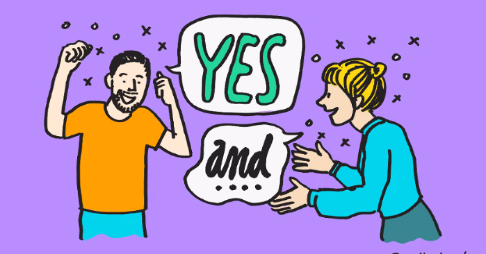
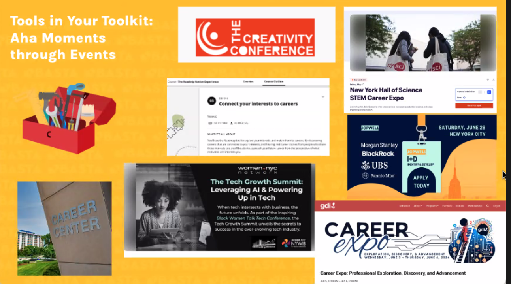
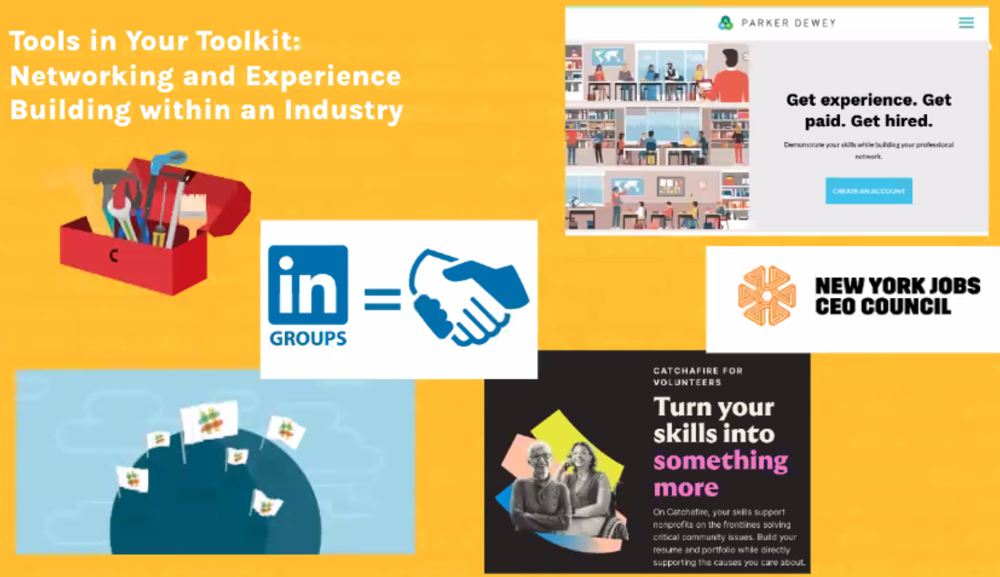
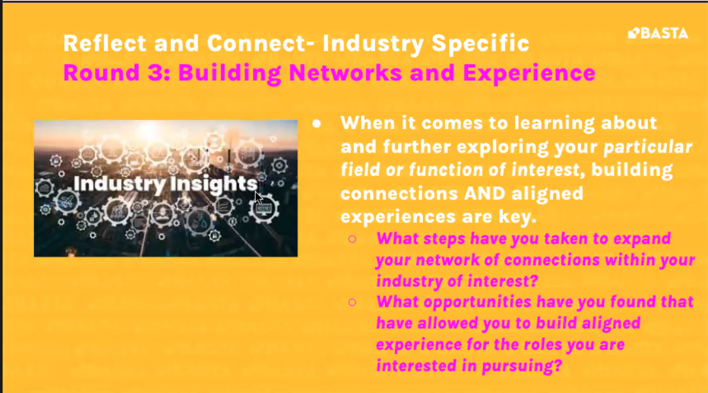

- 
- > Improv helps you prepare for
- Adaptability, Confident Communication, Creative Thinking. Visiting expert in the cll
- Aha moments are those moments when a lightbulb goes off and you realize something you didn't know before.
  What aha moments have you had about the career pathway job search since joining Basta?
  What aha moments have you had through BASTA events?
  What aha moments have you had from events and experiences outside of Basta?
	- College and understanding that career might be longer than the college you are attending.
- Being more open to career paths
	- Operations
	- Business Analytics
	- You can always grow up in the industries.
- You have more career tools
	- 
	- 
	-
		- 
		- When it comes to learning about and further exploring your particular field or function of interest, building connections AND aligned experiences are key.
		  What steps have you taken to expand your network of connections within your industry of interest?
		  What opportunities have you found that have allowed you to build aligned experience for the roles you are interested in pursuing?