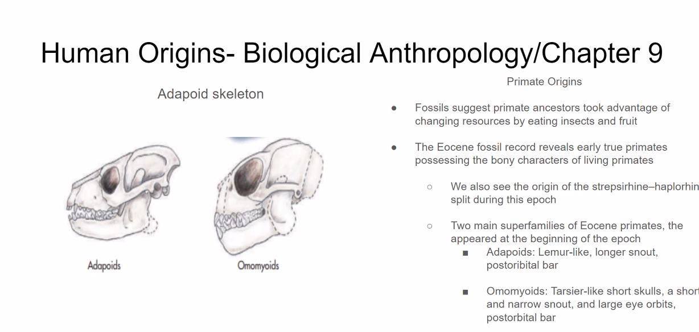
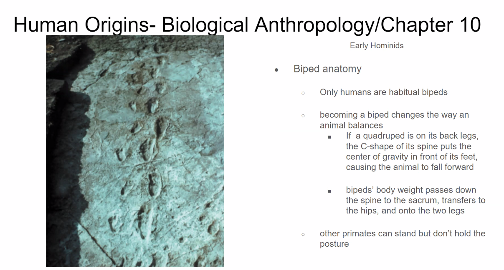

- Which two forms are considered the early Eocenne super primate? #card
  card-last-interval:: 4
  card-repeats:: 1
  card-ease-factor:: 2.6
  card-next-schedule:: 2024-04-27T16:30:37.297Z
  card-last-reviewed:: 2024-04-23T16:30:37.297Z
  card-last-score:: 5
	- 
- What is the reason you cant read DNA in a fossil? #card
  card-last-interval:: 4
  card-repeats:: 1
  card-ease-factor:: 2.6
  card-next-schedule:: 2024-04-27T16:29:51.922Z
  card-last-reviewed:: 2024-04-23T16:29:51.922Z
  card-last-score:: 5
	- Because it is decayed
- What is Prognathic Face and Postorbital bar used for?
	- The classification for primate fossils.
- What are the main characteristics of Bipade Anatomy
	- 
-