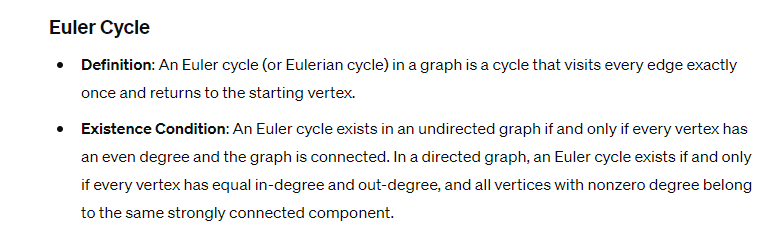
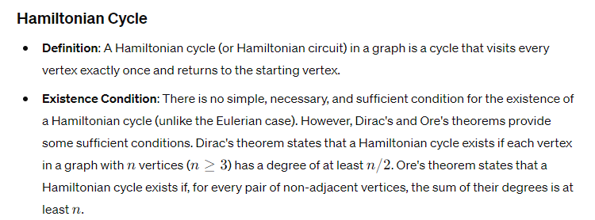
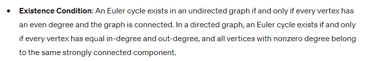
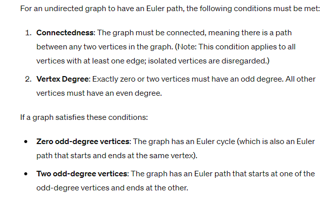

- What's the difference between Euler Cycle and Hamiltonian Cycle?
	- 
	- 
- Use Euler Cycle existence condition to determine if there is a cycle 
	-
	-
- Whats the difference between Euler Cycle and Euyler path
	- Euler Path instead of starting and ending on the same vertex, allows ending on a different vertex.
	- 
	- 
- What is the Set Partition Problem?
	- ### Definition
	  
	  Given a set 𝑆*S* of 𝑛*n* integers, the goal of the Set Partition problem is to determine whether it is possible to partition 𝑆*S* into two subsets 𝑆1*S*1​ and 𝑆2*S*2​ such that the sum of the elements in 𝑆1*S*1​ is equal to the sum of the elements in 𝑆2*S*2​.
	-
- What is the Traveling Salesman Problem?
	- ### Definition
	  
	  The Traveling Salesman Problem involves finding the shortest possible route that visits a given set of cities exactly once and returns to the origin city. Formally, given a list of 𝑛*n* cities and the distances between each pair of cities, the objective is to determine the shortest possible route that:
	- Starts at a specified city (the origin),
	- Visits each city exactly once,
	- Returns to the origin city.