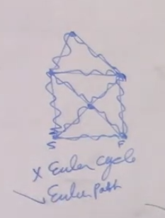

- What's the difference between Euler Cycle and Hamiltonian Cycle?
	- 
	- 
- Use Euler Cycle existence condition to determine if there is a cycle 
	-
	-
- Whats the difference between Euler Cycle and Euyler path
	- Euler Path instead of starting and ending on the same vertex, allows ending on a different vertex.
	- 
	- 
- What is the Set Partition Problem?
-