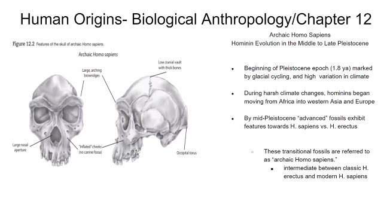

- What is the correct order of the Human Lineage? #card
	- 
	- Australopithecus -> Homo Habilis
	- Homo Neanderthalansis
	- Homo Sapiens
- What olden ones tools signify? #card
	- 
	- It signified tools and properties
- What characterizes Homo Erectus? #card
	- They were very tall, lived chasing
	- Had standardized tools: Clivers, Axes in mind had standard tools replicated
	- 
- Were the human species reproductively compatible? #card
	- Yes, they produced hybrids
	- If neantherlands and homosapiens reproduceted
		- Archaic are produced from Neanderthals and Erectus
	- It would be a archaic Homo sapiens.
	- 