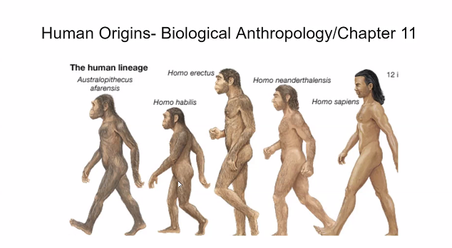
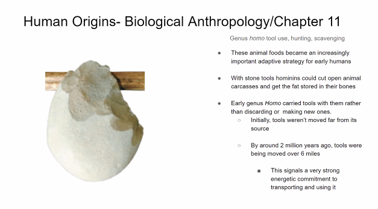
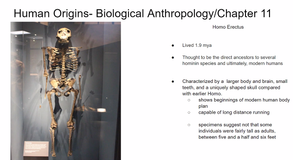

- What is the correct order of the Human Lineage? #card
	- 
	- Australopithecus -> Homo Habilis
	- Homo Neanderthalansis
	- Homo Sapiens
- What olden ones tools signify? #card
	- 
	- It signified tools and properties
- What characterizes Homo Erectus? #card
	- They were very tall, lived chasing
	- Had standardized tools: Clivers, Axes in mind had standard tools replicated
	- 
- Were thehuman species reproductively compatible? #card
	- Yes, they produced hybrids