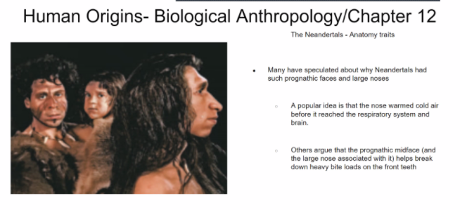
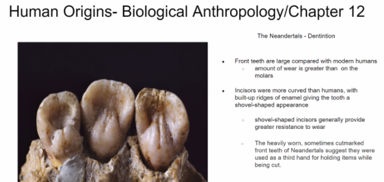
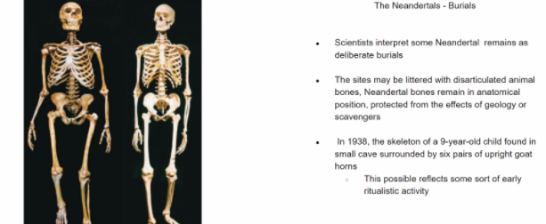
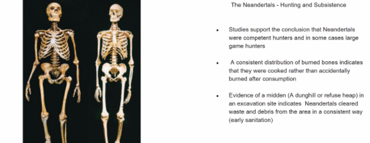
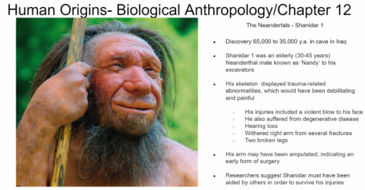
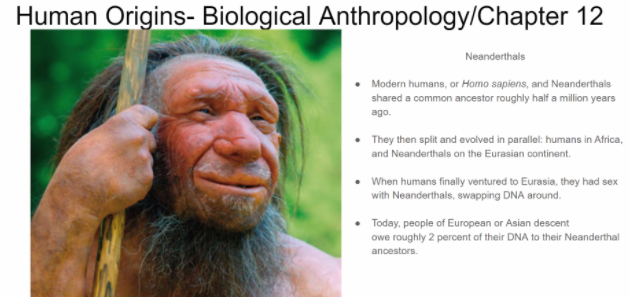

- What is the correct order of the Human Lineage? #card
	- 
	- Australopithecus -> Homo Habilis
	- Homo Neanderthalansis
	- Homo Sapiens
- What olden ones tools signify? #card
	- 
	- It signified tools and properties
- What characterizes Homo Erectus? #card
	- They were very tall, lived chasing
	- Had standardized tools: Clivers, Axes in mind had standard tools replicated
	- 
- Were the human species reproductively compatible? #card
	- Yes, they produced hybrids
		- Archaic are produced from Neanderthals and Homosapiens
	- It would be a archaic Homo sapiens.
	- 
- What Makes the Mauler Mandible Unique #card
	- 
- What makes the Bodo Cranium Unique?
	- 
- What's the point of Ritual Burial? #card
	- Religion
	- 
	- They had dreams about people who were dead.
	- Opened the idea that they might be somewhere else?
-
- 
- Who was Shanidar 1? What doe sit mean? #card
	- 
	- He probably had taken cared of by their own kind
	- The broken bones had to feed him and take care of him. Group had to compensate,
	- They didnt leave him behind
	- 
- What's the main adaptation of Neandertals? #card
	- 
- Is there a link between on-human privates and primates?
	- 
- -
	- 
- Mention key points that distinguish Neanderthal anatomy #card
	- Large Brain cases
	- Mid face projection
	- Spoonshap recisors
	- Robust quality of the bone.
	- Ribcage
	- 
- Why nendertals had prognatic faces and large noses? #card
	- 
	- Allows more space to warm he air that reaches the respiratory system
- The bones are robust
	- 
- Neandertals Burials, Hunting and Subsistance
	- 
	- 
- Shanidar 1
	- 
- What is the term that descrives when they evolve together? #card
	- Adaptive Radiation. Sex with Neanderthals have those DNAs, roughly 2% to their Neanderthals ancestors
	- 
	- Where you have Neanderthals you also have depression and addiction.
		- Might provide some sort of resiliance?
- What are the 4 key points
	-
	-