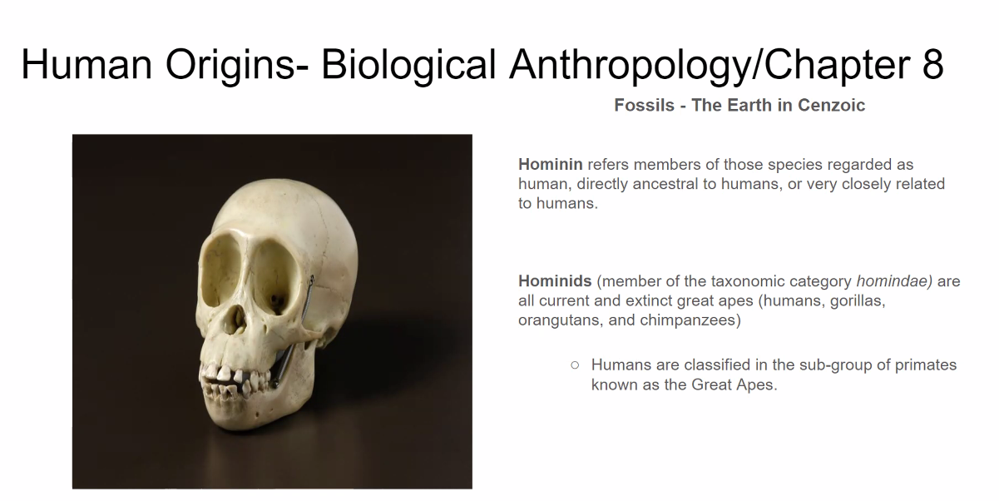
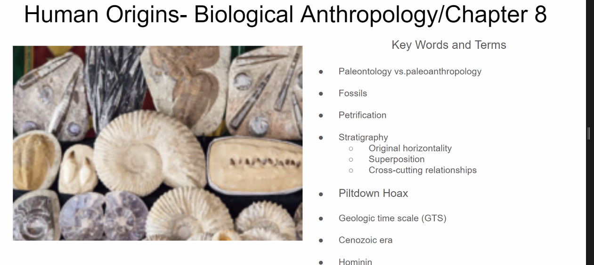

- #ANTH
- In what epoch did the strepsirrhines and haplorrhines emerge?
- Fossil Geologic Time Scale
	- 
- Whats the difference between Hominin and Hominids?
	- Almost any biped vs taxonomic term for category of extinct great apes
	- 
- Key Terms:
	- 
-