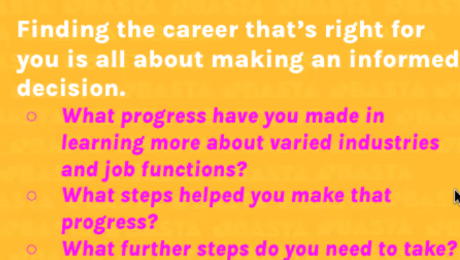

- Notes
	- interviewing
		- [[STAR METHOD]]
		- [[Operations Roles]]
		- [[Basta]]
		- [[Practices]]
		- [[Writing Follow up Emails]]
		- [[Introducing Yourself]]
		- [[Submitting personalized]]
			- Personalizing Resume to pass the robot grader.
	- Developing Job Searching Software
		- Practicing Introducing yourself!
		- Keeping track of applications
		- Keeping an eye of networking events
			- Hackathons
			- Tech Presentations for Startup events
		- Keeping track of people you meet and sending research networking.
	- 
		-
		-
- Actionables
	- Before Interviewing:
		- TODO Craft 10 Stories per job using the STAR Method
		-