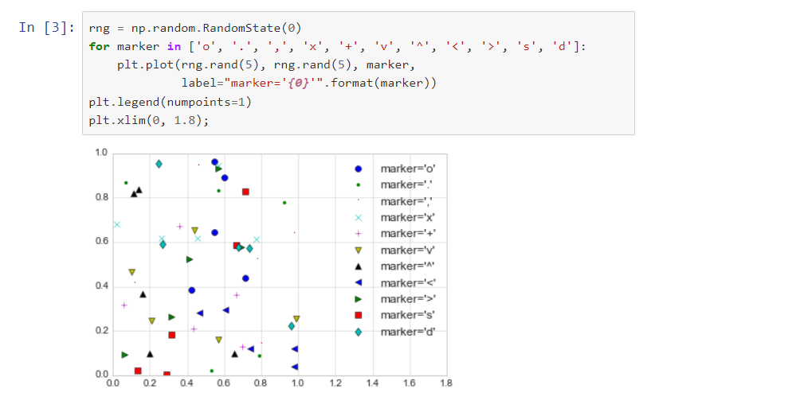
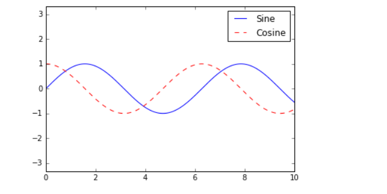
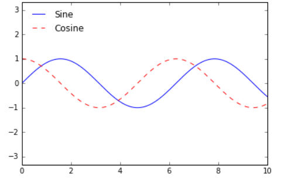
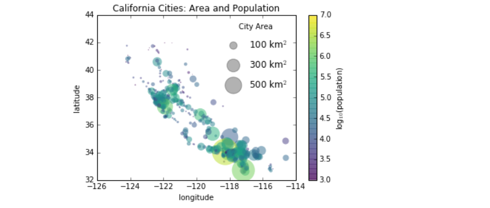
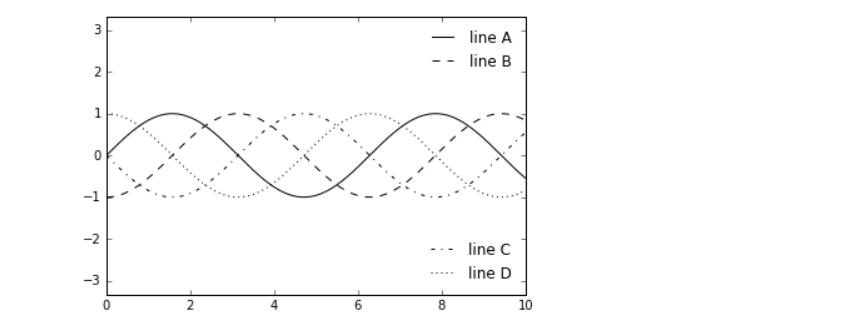
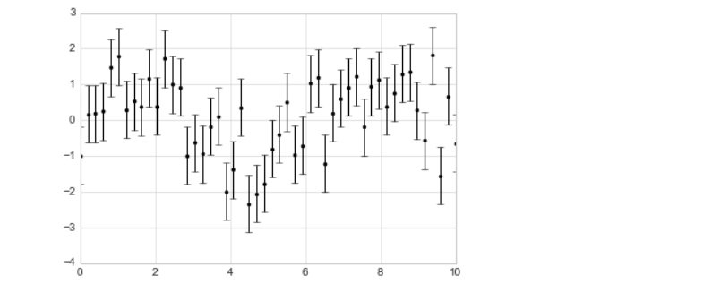
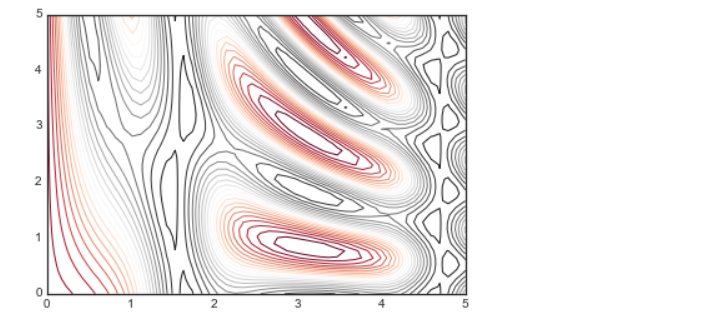

## Guide
	- Book Guide Table of Contents
		- https://jakevdp.github.io/PythonDataScienceHandbook/index.html
	- How to use different figures to scatter plot? #card #matplot
	  card-last-score:: 3
	  card-repeats:: 1
	  card-next-schedule:: 2024-04-14T15:55:32.015Z
	  card-last-interval:: 4
	  card-ease-factor:: 2.36
	  card-last-reviewed:: 2024-04-10T15:55:32.019Z
	  collapsed:: true
		- As the {{cloze third parameter}} in a plt plot
		- 
		- ```python
		  rng = np.random.RandomState(0)
		  for marker in ['o', '.', ',', 'x', '+', 'v', '^', '<', '>', 's', 'd']:
		      plt.plot(rng.rand(5), rng.rand(5), marker,
		               label="marker='{0}'".format(marker))
		  plt.legend(numpoints=1)
		  plt.xlim(0, 1.8);
		  ```
- ## Scatter Plotting
  collapsed:: true
	- What does `describe()` do? #card #pandas
	  collapsed:: true
		- It describe mean, etc statistics
	- Aside from the different features available in `plt.plot` and `plt.scatter`, why might you choose to use one over the other? #card #matplot
	  collapsed:: true
		- `plt.plot` should be preferred over `plt.scatter` for large datasets.
		- `plt.plot` cannot do sizes and colors in comarison
- ## Customizing Legends
  collapsed:: true
	- How to create legends like the following: #card #legends 
	  collapsed:: true
		- {{cloze ax.plot(x, np.sin(x), '-b', label='Sine')
		  ax.plot(x, np.cos(x), '--r', label='Cosine')}}
		- ```python
		  x = np.linspace(0, 10, 1000)
		  fig, ax = plt.subplots()
		  ax.plot(x, np.sin(x), '-b', label='Sine')
		  ax.plot(x, np.cos(x), '--r', label='Cosine')
		  ax.axis('equal')
		  leg = ax.legend();
		  ```
	- How to move the legend to the upper left? #card #legends 
	  collapsed:: true
		- ```python
		  ax.legend(loc='upper left', frameon=False)
		  ```
	- How to plot size at legends? 
	  collapsed:: true
		- register the scatter sizes demostration
		- ```python
		  
		  # Here we create a legend:
		  # we'll plot empty lists with the desired size and label
		  for area in [100, 300, 500]:
		      plt.scatter([], [], c='k', alpha=0.3, s=area,
		                  label=str(area) + ' km$^2$')
		  plt.legend(scatterpoints=1, frameon=False, labelspacing=1, title='City Area')
		  
		  ```
		- ```python
		  import pandas as pd
		  cities = pd.read_csv('data/california_cities.csv')
		  
		  # Extract the data we're interested in
		  lat, lon = cities['latd'], cities['longd']
		  population, area = cities['population_total'], cities['area_total_km2']
		  
		  # Scatter the points, using size and color but no label
		  plt.scatter(lon, lat, label=None,
		              c=np.log10(population), cmap='viridis',
		              s=area, linewidth=0, alpha=0.5)
		  plt.axis(aspect='equal')
		  plt.xlabel('longitude')
		  plt.ylabel('latitude')
		  plt.colorbar(label='log$_{10}$(population)')
		  plt.clim(3, 7)
		  
		  # Here we create a legend:
		  # we'll plot empty lists with the desired size and label
		  for area in [100, 300, 500]:
		      plt.scatter([], [], c='k', alpha=0.3, s=area,
		                  label=str(area) + ' km$^2$')
		  plt.legend(scatterpoints=1, frameon=False, labelspacing=1, title='City Area')
		  
		  plt.title('California Cities: Area and Population');
		  ```
	- How to separate the legends on bottom and top? 
	  collapsed:: true
		- Add as `legend` and bottom as `artist`
		- ```python
		  fig, ax = plt.subplots()
		  
		  lines = []
		  styles = ['-', '--', '-.', ':']
		  x = np.linspace(0, 10, 1000)
		  
		  for i in range(4):
		      lines += ax.plot(x, np.sin(x - i * np.pi / 2),
		                       styles[i], color='black')
		  ax.axis('equal')
		  
		  # specify the lines and labels of the first legend
		  ax.legend(lines[:2], ['line A', 'line B'],
		            loc='upper right', frameon=False)
		  
		  # Create the second legend and add the artist manually.
		  from matplotlib.legend import Legend
		  leg = Legend(ax, lines[2:], ['line C', 'line D'],
		               loc='lower right', frameon=False)
		  ax.add_artist(leg);
		  ```
- ## Visualizing Errors
  collapsed:: true
	- How to show the error bars? 
		- Had the error bars on the `dy` using the parameter `yerr` in `plt.errorbar`
		- ```python
		  %matplotlib inline
		  import matplotlib.pyplot as plt
		  plt.style.use('seaborn-whitegrid')
		  import numpy as np
		  x = np.linspace(0, 10, 50)
		  dy = 0.8
		  y = np.sin(x) + dy * np.random.randn(50)
		  
		  plt.errorbar(x, y, yerr=dy, fmt='.k');
		  ```
	-
- ## Customizing Colorbar
	- What Matplot tool is being used? 
	  collapsed:: true
		- ```python
		  plt.contour(X, Y, Z, 20, cmap='RdGy');
		  ```
	-
-