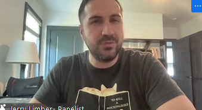

- Make sure that the ship runs.
	- Show up on day one and there are
	- Specific Entry level roles. Suggestion would be
	- Research and find skillset if it matches with what you do.
	- Identify an industry in which
- Searching for Jobs Filters
	- Search for Entry  + Operation
	- Analytics of a businesses | Analyst in the role.
		- Coordinator | Analyst | Associates | Business Support |  Standard Operation Procedure-> Entry Positions.
		- Creating systems or refining systems that already exists. Analytics.
- How it relates to my position
- Tell us A little about yoruself.
	- Focus more in passion and aptitude, the right mindset and the wanting to sell.
	- You should be Proactive, Problem Solving, Innovation, Organization.
- Applications for Entry Level
	- Look at the job description | Will should have prepared and having genuine curiosity.
	- Follow ups! Having Following Up Emails
	- If you get well with your team, because you will spend a lot of time with them. Culture fit.
	- Less about the skills but also the resourcefulness, why you entrust the role?
	-
- What does a typical day look like for each of you?
	- A workstream and the program meeting where you are directly on flight.  Balance Tactical and Strategic work. Get things done.
	- **Tactical Work** Willingness to roll up your sleeves.
	- If a client asks for it, is whatever is there. Naturally and operational roles
	- For job searching process ask: What are the keworks
- Role
	- Help your boss life, trying to find solutions and present something back up.
	- Making life easier for others.
	- Accurate views. High counts. Statuses of people leaving and pieces of information and complaining on this in meetings and taking it to figure yourself and automated exports to build dashboards that automatically updates the systems to make sense for people.
	- Results of doing that over and over.
- Carla Agnite
	- Mind blogging to have on the cloud. Making something more efficient than sending an excel back and forth.
- Rebeecca McPhail
	- What is useful for them?
	- Understand the business objectives and how to make their life easier
- Projects to build yourself:
	- Build pipelines for Data, Documentation, etc. from games.
	- 
	- 
	- Jerry Limber
		- Use cases for AI and entry level of interview. Study uses of AI, and
-
	-