- Real Estate Game Idea
	-
- Class 1
  collapsed:: true
	- Here some key items when it comes to the location, and the items.
	- The more amenities you have the better.
	- What makes you great at investing is the limited count of capital.
	- Gets a lot of reps first.
	- What is the process of finding prices
		- 
		- Ask those building and ask what you can charge.
			- Things that cane help you understand if you can charge more as such as Year Built.
		- What drives and increase value?
			- Understanding Cashflow is what increases the value of the property
			- 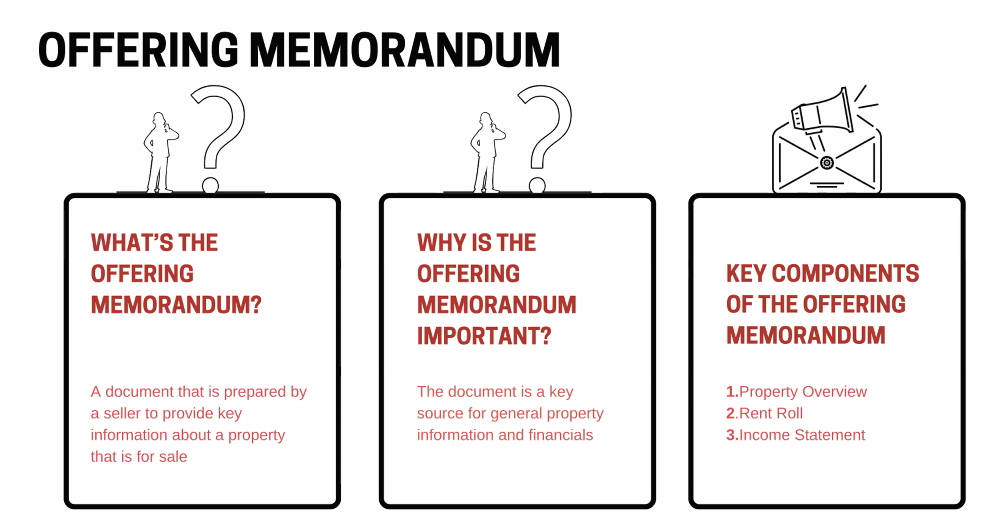
				- 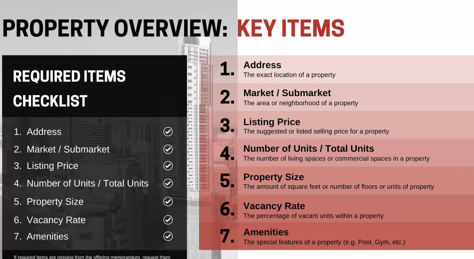
				- The address and the location is everything.
				- The easiest way to entrepreneuship
					- Try to get a large firm first.
					- Get that exposure
				- Rent Roll
					- 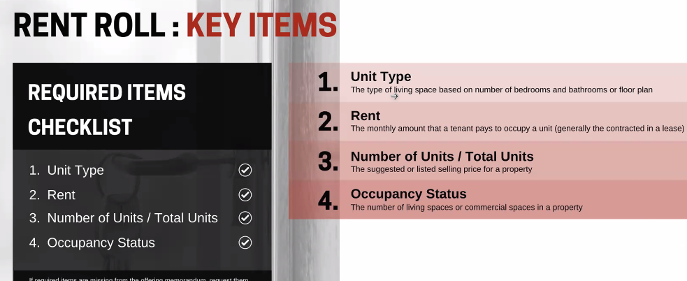
					- 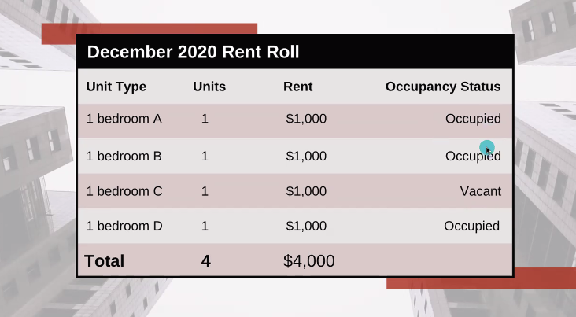
				- What is gross Rent?
					- The potential of earning that amount
						- 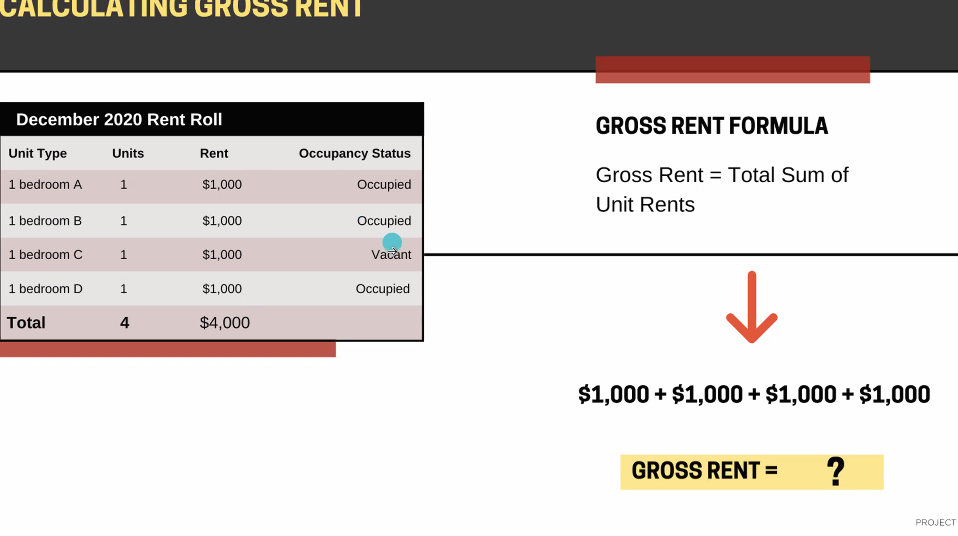
					- Vacancy Loss Formula
						- 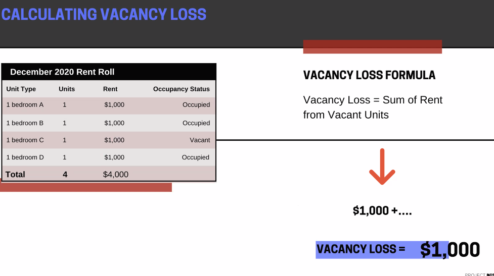
					- Total Revenue
						- Net rent + Other Things here
						- 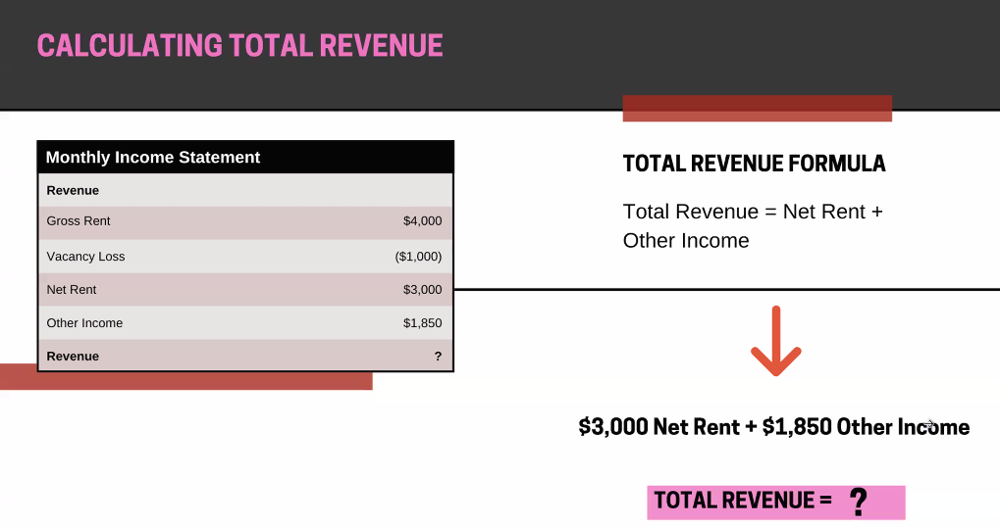
					- Net Operating Formula
						- 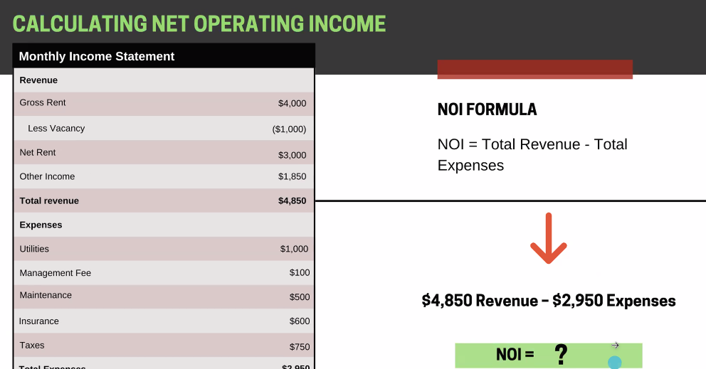'
					- Total Expenses
						- 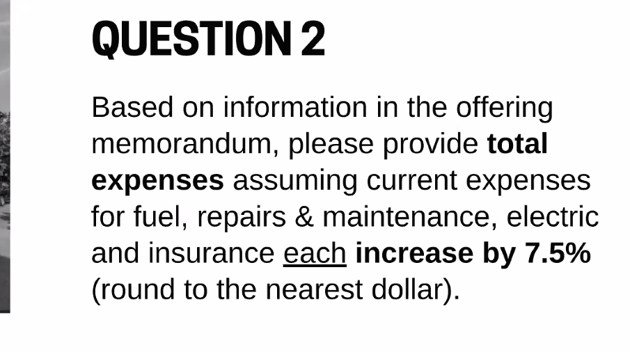
						- 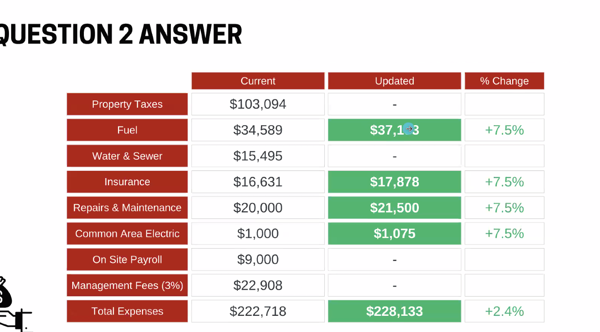
					- 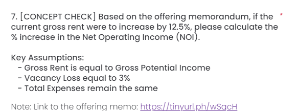
						- 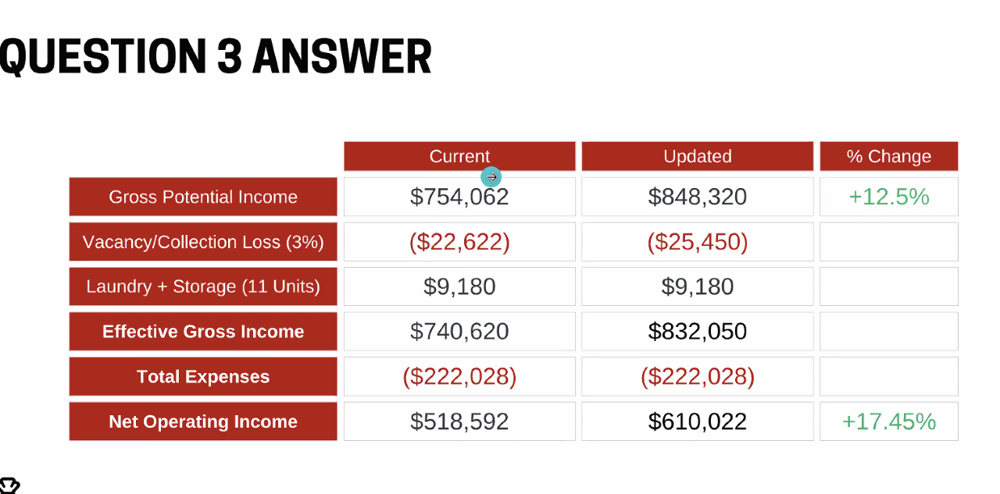
				-
	- What is Market Rent
		- 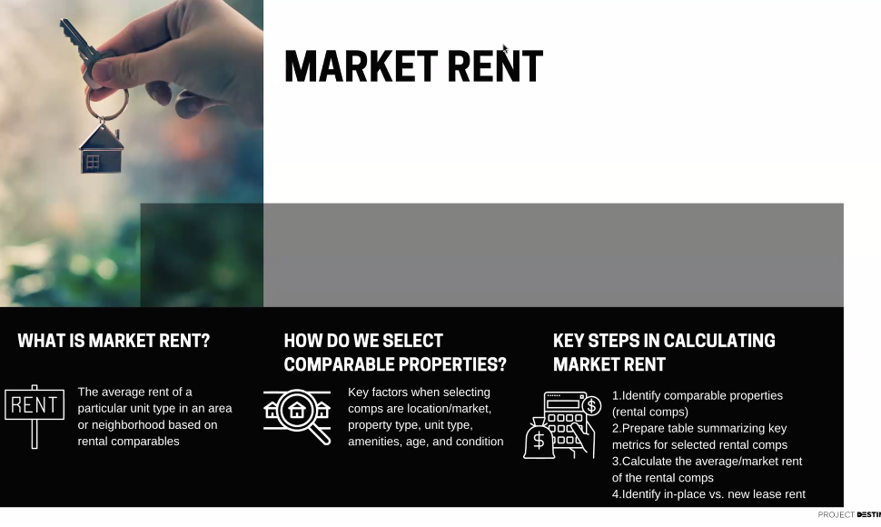
	- Find data about your competition
- Class 2
-