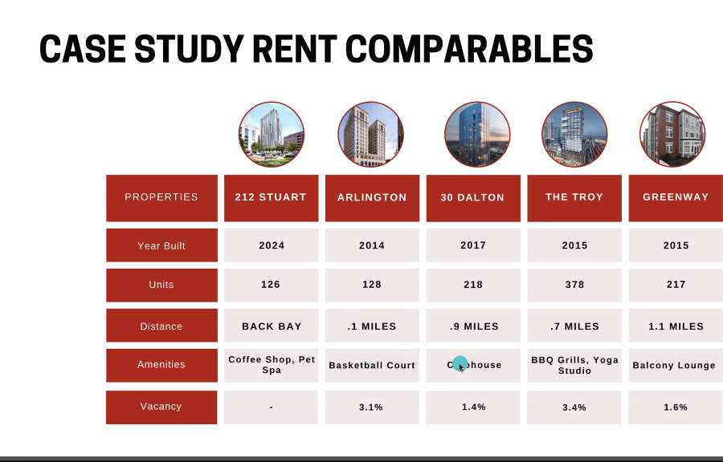

- Real Estate Game Idea
	-
- What is Market Rent
	- 
	- Find data about your competition
- What is the process of finding prices
	- 
	- Ask those building and ask what you can charge.
		- Things that cane help you understand if you can charge more as such as Year Built.
	- What drives and increase value?
		- Understanding Cashflow is what increases the value of the property
		- 
			- 
			- The address and the location is everything.
			- Here some key items when it comes to the location, and the items.
			- The more amenities you have the better.
			- What makes you great at investing is the limited count of capital.
			- Gets a lot of reps first.
			- The easiest way to entrepreneuship
				- Try to get a large firm first.
				- Get that exposure
			- Rent Roll
				- 
				- 
			- What is gross Rent?
				- The potential of earning that amount
					- 
				- Vacancy Loss Formula
					- 
				- Total Revenue
					- Net rent + Other Things here
					- 
				-
			-