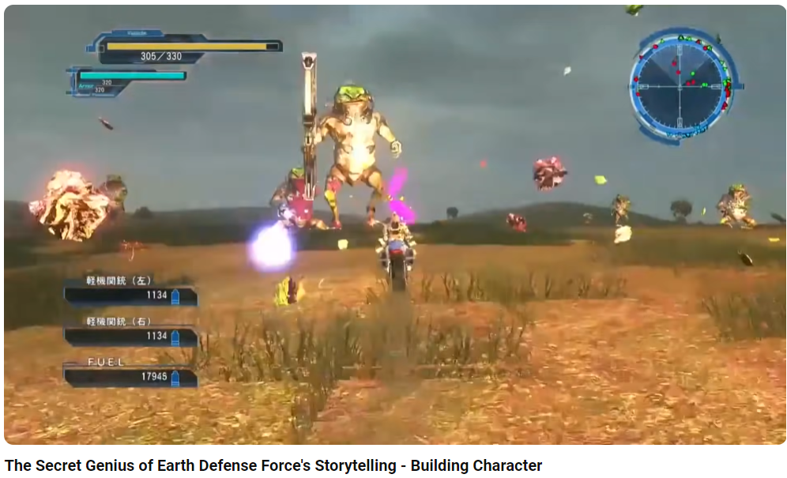

- General Tips:
	- Better done without Online - Multiplayer. Multiplayer has to somehow link or just be for fun.
- Background Storytelling #Game_Design
	- Also like no story telling. This can be seen in such as Mario etc. Where people come from the mechanics first.
	- Examples
	  collapsed:: true
		- {{video https://www.youtube.com/watch?v=cSz127Adpqs&ab_channel=SoberDwarf}}
		- Here the story telling takes in the background, not taking itself that seriously. The player can expect to ignore it and not taking
		- That's a story of beautiful Story Telling.
		- 
- Movie/Series Like Storytelling
	-
- Story Building
	- Games that does this:
		- Rimworld
		- Total War
		- Models and simulations that create their own stories.
- Multiplayer
	- Better not have storytelling, or backgorund-like. Make it dumb Fumnmu. with some hidden Trailer and Backgrounds
	- Anti Patterns:
		- Genshin Impact - Breaks the immersion having characters. Makes no sense to have that many cut scenes to be honest
		- Wow and Other MMORPGs such as Dragon Nest. (Breaks Immersion, is everyone on this epic )
	- Good Examples
		- Lethal Company
		- Hell Divers
		-
		-