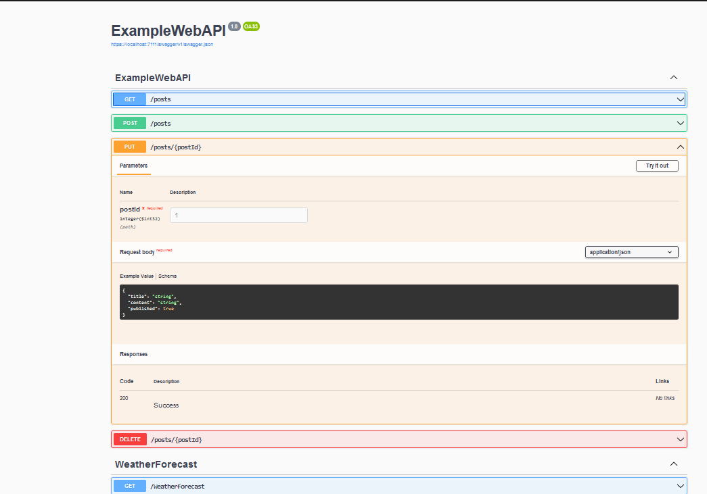

- Meta: #project #crashcourse
- Crashcourse lInk: Creashcourse: https://rubenheeren.com/articles/aspdotnet-web-api-crash-course-exploring-dotnet-e4.html
- Results:
	- 
	- Gtihub: https://github.com/NeneWang/ExampleWebAPI
- Key Things to explore:
	- LATER Dotnet migrations cheatsheet:
	- LATER Memorize pieces of the code to setup
	- LATER Basic Libraries that were used on this case
	- LATER Activity: Instead of memorizing things. Try to fill in the gaps into where the documentation can be found at each stage.
	- [[entitity-framework-cheatsheet]]
	-