- What are the defining features of a primate
	- Gneral body plaims
	- That have larger brains
	- generalized body plan
	- {:height 358, :width 602}
- What are the differences between strepsirhine and Haplorrhine?
  collapsed:: true
	- 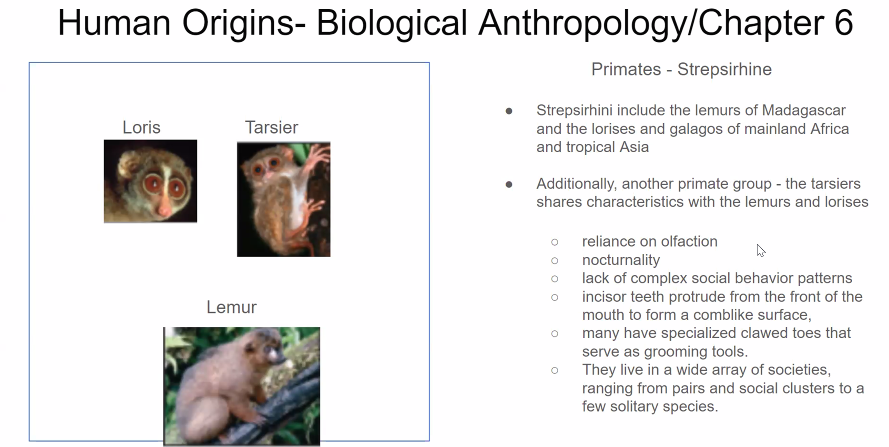
	- 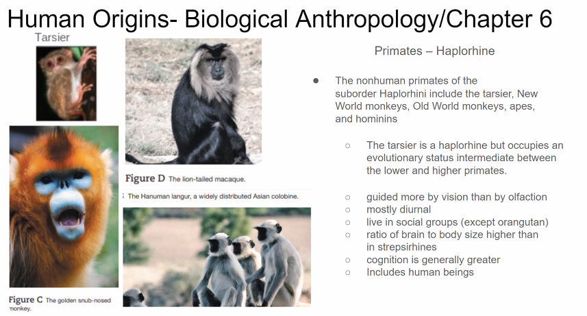
	- Strepsirhines
	  1. Groups: Includes lemurs, lorises, and galagos (bush babies).
	  2. Nose: Characterized by a "wet nose" or rhinarium, which is a moist, fleshy pad at the end of the nose that enhances their sense of smell.
	  3. Brain: Typically have smaller brains relative to their body size compared to haplorrhines.
	  4. Vision Possess a more developed sense of smell and have a more limited color vision. Many have a tapetum lucidum, a reflective layer in the eye that enhances night vision.
	  5. Social Behavior: Generally more solitary or live in smaller social groups compared to many haplorrhines.
	  6. Reproduction: Tend to have a more seasonal breeding cycle.
	  7. Physical Traits:  Often have a grooming claw on the second toe of the foot and a tooth comb, which is a specialized set of lower front teeth used for grooming.
	  8. Geographic Distribution: Primarily found in Madagascar (lemurs) and tropical Africa and Asia (lorises and galagos).
	  Haplorrhines
	- Haplorrhines
		- 1. Groups: Includes tarsiers, monkeys (both New World and Old World), and apes (including humans).
		  2. Nose:  Characterized by a "dry nose" or a simple nose without a rhinarium.
		  3. Brain: Typically have larger brains relative to their body size compared to strepsirhines.
		  4. Vision: Have a more developed sense of vision with better color vision. Most do not have a tapetum lucidum.
		  5. Social Behavior: Tend to be more social, living in larger and more complex social groups.
		  6. Reproduction: Have a less seasonal and more continuous breeding cycle.
		  7. Physical Traits: Lack a grooming claw and tooth comb.
		  8. Geographic Distribution: Found in a wider range of habitats across the Americas, Africa, and Asia.
		  Summary
	- Main Differences
		- Nose: Strepsirhines have a wet nose (rhinarium); haplorrhines have a dry nose.
		  Brain Size: Strepsirhines have relatively smaller brains; haplorrhines have relatively larger brains.
		  Vision: Strepsirhines rely more on smell and often have night vision; haplorrhines rely more on vision and have better color vision.
		  Social Structure: Strepsirhines are more solitary or in small groups; haplorrhines are more social.
		  Reproduction: Strepsirhines have seasonal breeding; haplorrhines have less seasonal breeding.
		  Grooming Adaptations: Strepsirhines have a grooming claw and tooth comb; haplorrhines do not.
		  Distribution: Strepsirhines are found mainly in Madagascar, Africa, and Asia; haplorrhines are found in the Americas, Africa, and Asia.
	-
- What is mean by the exception of the Tariser
  collapsed:: true
	- 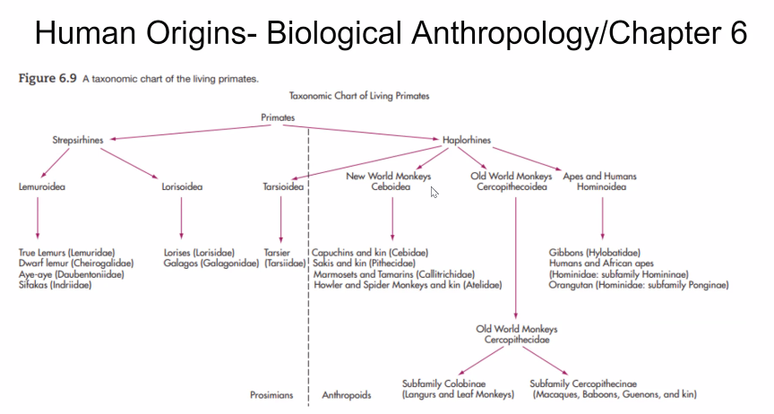
	- Almost equal traits between haplorines and sttephrines traits:
	- However it ways more heavily on the way of the Haplorrines
- What are the major discoveries of Jane Goodall?
	- Tool Use: Chimpanzees make and use tools, such as twigs to extract termites.
	- Complex Social Behavior: Documented social hierarchies, grooming, and intergroup violence.
	- Emotional Depth: Observed emotions and distinct personalities in chimpanzees.
	- Dietary Habits: Chimpanzees have an omnivorous diet, including hunting smaller mammals.
	- They can also catch our diseases
- Asynchronous Tree Cycles?
	- Means that they dont grow fruits at the same time:
	- 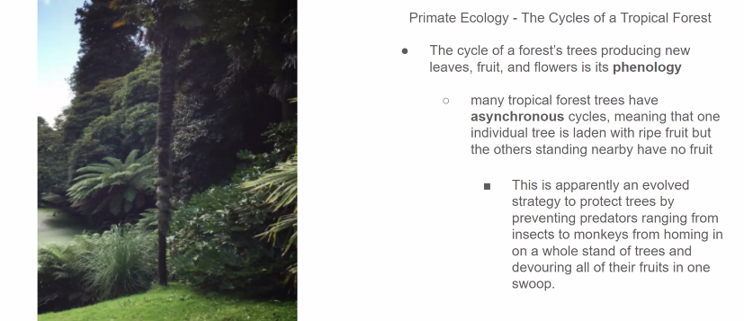
	- makes it more challanging to find the right fruit:
		- So the Spider monkeys have to think and memorize: Which makes thems marter with evolutionaruy pressure.
		- 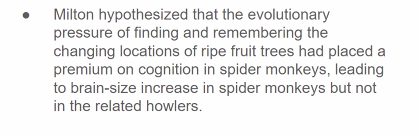
- Under what COnditions are territorties not defended?
	- Territories are not defended if energitacally doenst make sense
- What are the tree settings in which primates are studied
	- Field, captivity, and Semi Free Studying
	- 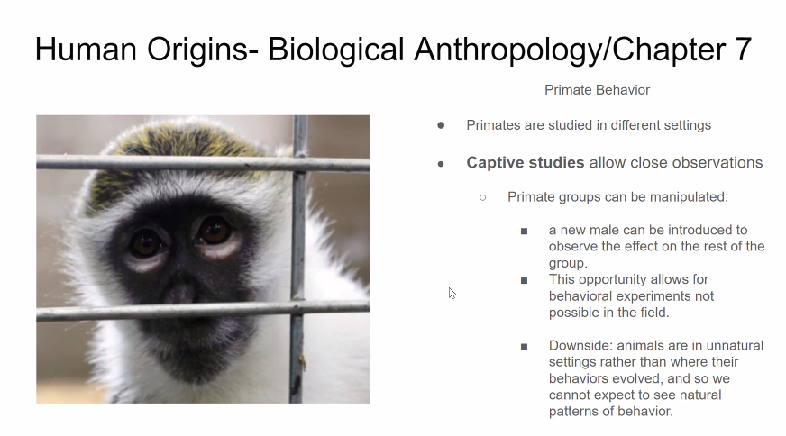
	- 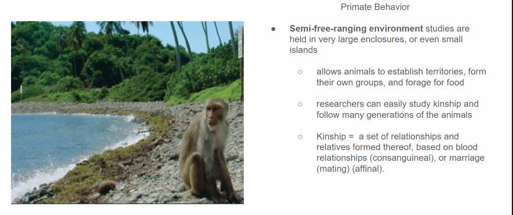
- What is reproductory Asymmetry?
	- 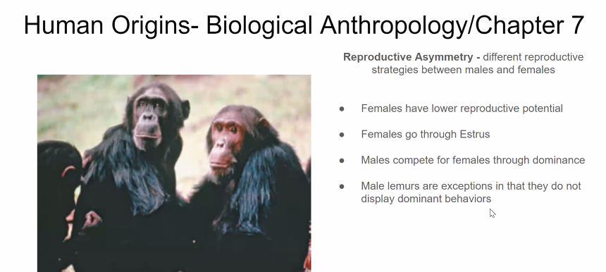
	- Females' have lower reproductive potential
	- Estrus is the period of sexual receptivity and fertility in female mammals, often marked by behavioral changes signaling readiness to mate.
	- Chnages:
		- Appearence, smell and behaviours
	- Male Lemurs:
		- Exception do not display dominnat behaviours
- Solitary Group:
	- 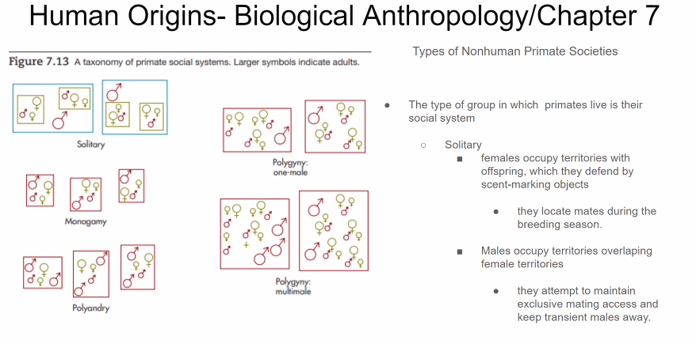
	- Lemurs example: are solitary, are kicked out after mating.
	- Monogamy, where the father and mother might have affairs outside but:
	- If the polygoni is too big, the male will bring more males.
- 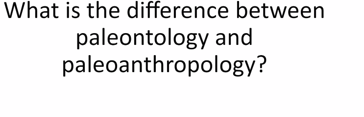
	- 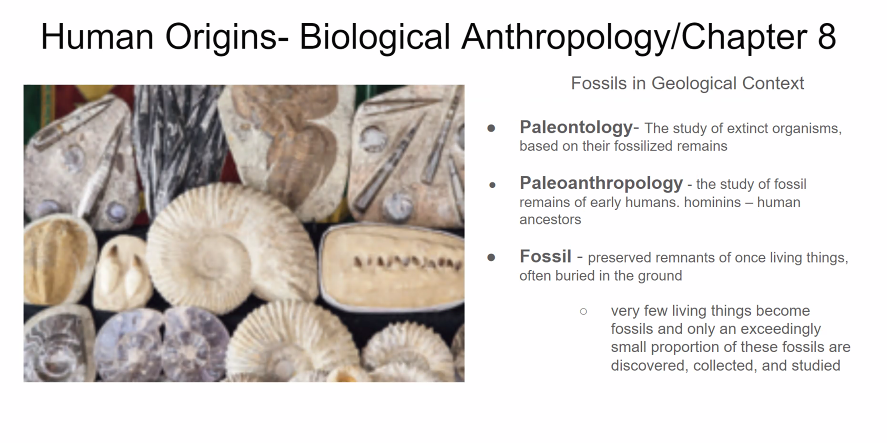
	- How do they become fossil?
		- 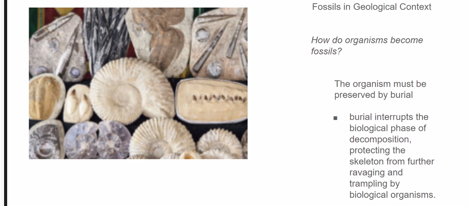
		- 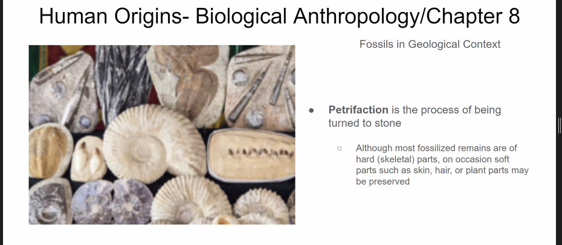
- 3 layers of stratigraphy?
	- 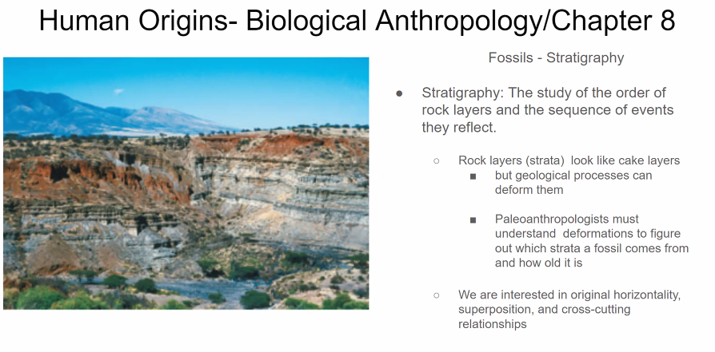
	- 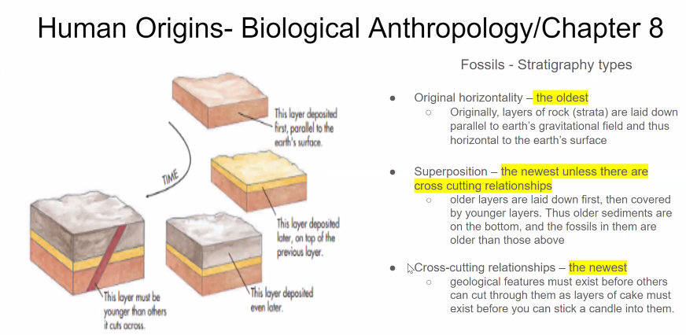
- What is the Pilldown Hoax?
	- 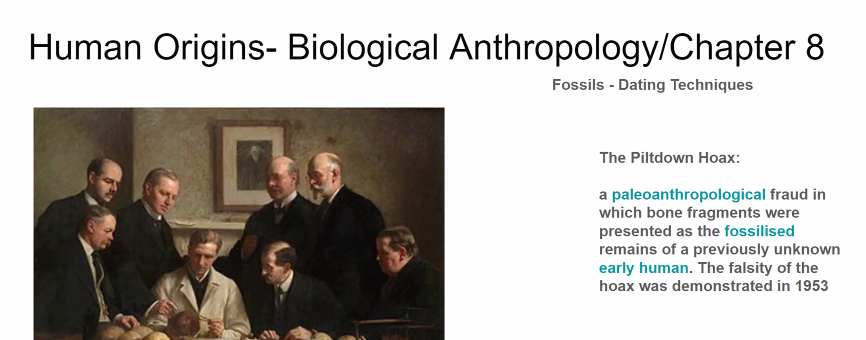
	- Bones were glued together to show that there was a missing ap
-