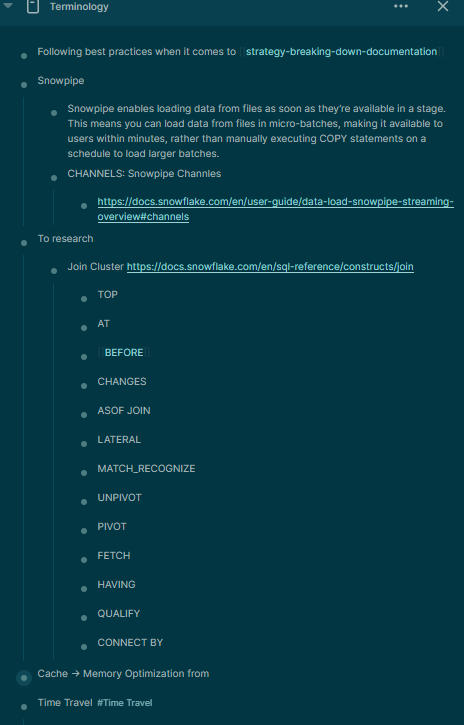
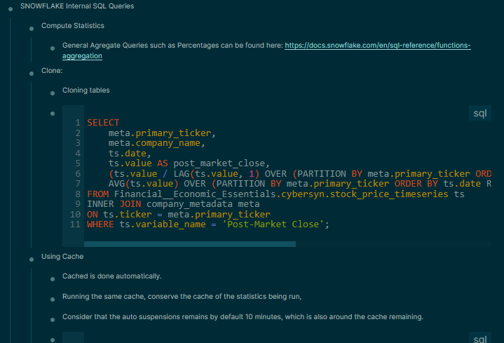

- meta: #strategy #Documentation
- Prompt: Whats an optimal way to master a framework or Library?
- Considerations:
	- Reading the Official Documentation
	- Just reading the documentation might not mean officially understanding what's going on
		- Requires Basic Practical understanding first
		- Then using a guide is always good.
		- Documentation just understanding the overall structure and function references is enough.
	- Very high level memorization prompts: Ideally using Concept Logs, to define and to memorize - questions would be in the order of:
		- Why would you use this class and what is usually stored on this library tools?
- Candidates Solutions
	- Writing Code, then checking on the code. And explore the classes and also view what other potential methods you could have used given that class.
		- If don't know yet, understand it's parent library
		- Workflow for integrating Documentation and Learning:
			- Adding the documentation path to the corresponding [[Documentation]] section.
			- Once the project is done, search and add details to the page provided for such documentation to be annotated.
			- Contain an Terminology sidebar to organize things to research AFTER. such as at [[Terminology]]
			  collapsed:: true
				- 
				-
			- While exploring Tutorials. or following courses, have the good habit of taking screenshots + Where in the documentation such as done here: [[SQL Reference]]
			  collapsed:: true
				- 
				-
		- Reasons
			- This solution is **more** efficient than the base solution of (attempting to memo all documentaiton)
			- Understand what is what for, by exploring close problems.
			-